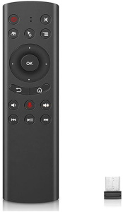

# RF remote MQTT gateway

This tool allows you to use a cheap RF remote control as an universal input for your home automation.

I used a ["G20 remote control"](https://www.google.com/search?q=G20+remote+control) which is also sold as "Nvidia Shield replacement remote".



You need a linux machine. It is verified working with Debian 10.

# Step 1: Download
You need to [install NodeJS before](https://nodejs.org/en/download/package-manager).

```
cd ~
git clone git@github.com:magcode/mqtt-tools.git
cd mqtt-tools/remotekeys
```

# Step 2: Configure
You need to configure the tool in the file `config.yaml`.

```
default:
  mqtt:
    broker: mqtt://broker         # your mqtt broker connection
    topic: home/room/remote       # mqtt topic
  event1: event3                  # ID of the event #1
  event2: event5                  # ID of the event #2
  event3: event6                  # ID of the event #3
  serviceuser: me                 # user name for the linux service
```

## How to get the event id's
The remote creates three event id's.

```
cat /proc/bus/input/devices  | grep -P '^[NH]: ' | paste - - | grep "SG.Ltd" | grep -v "Mouse"
```

It will return something like

```
N: Name="SG.Ltd SG Control Mic" H: Handlers=sysrq kbd event3 leds
N: Name="SG.Ltd SG Control Mic Consumer Control"        H: Handlers=kbd event5
N: Name="SG.Ltd SG Control Mic System Control"  H: Handlers=kbd event6
```

In this example the event id's are `event3`, `event5`, `event6`

## Hint for proxmox/lxc
Use something like this in your lxc `*.conf` file:
```
lxc.cgroup.devices.allow: c 13:67 rwm
lxc.mount.entry: /dev/input/event3 dev/input/event10 none bind,optional,create=file
lxc.cgroup.devices.allow: c 13:69 rwm
lxc.mount.entry: /dev/input/event5 dev/input/event13 none bind,optional,create=file
lxc.cgroup.devices.allow: c 13:70 rwm
lxc.mount.entry: /dev/input/event6 dev/input/event14 none bind,optional,create=file
```
Now in your container the event id's are: `event10`, `event13`, `event14`


# Step 3: Install
```
npm install
sudo node install.js
```

# Start/stop
```
sudo service remotekeys start
sudo service remotekeys stop
```

# Uninstall
```
sudo service remotekeys stop
cd ~/mqtt-tools/remotekeys
sudo node uninstall.
```

# Using it

## Normal key press
If you press a button you will find the following MQTT message triggered:

```
home/room/remote/KEY_MUTE trigger
```

## Long press
Long pressing a button will trigger the following MQTT message:
```
home/room/remote/KEY_MUTE-LONG trigger
```


## Auto-Repeat
Some keys /e.g. `KEY_VOLUMEUP` support auto-repeat. If you hold the key multiple MQTT messages will be triggered.

# Notes
* You cannot use the mouse feature with this tool.
* The "mic" button is not useable.
* In case the remote does not send keys, press the "mouse" button once.

You should disable the power key handling in Linux. Otherwise your system may shut down if you press the "Power" button on the remote.

For Debian the following must be set in `/etc/systemd/logind.conf`

```
HandlePowerKey=ignore
HandleSuspendKey=ignore
```

# Openhab integration

Example things file
```
Thing mqtt:topic:RoomRemote "Room Remote" (mqtt:broker:mosquitto) {
    Channels:
        Type string : KEY_UP "KEY_UP" [ stateTopic="home/myroom/remote/KEY_UP", trigger=true]
        Type string : KEY_DOWN "KEY_DOWN" [ stateTopic="home/myroom/remote/KEY_DOWN", trigger=true]
        Type string : KEY_ENTER "KEY_ENTER" [ stateTopic="home/myroom/remote/KEY_ENTER", trigger=true]
        Type string : KEY_LEFT "KEY_LEFT" [ stateTopic="home/myroom/remote/KEY_LEFT", trigger=true]
        Type string : KEY_RIGHT "KEY_RIGHT" [ stateTopic="home/myroom/remote/KEY_RIGHT", trigger=true]
        Type string : KEY_HOMEPAGE "KEY_HOMEPAGE" [ stateTopic="home/myroom/remote/KEY_HOMEPAGE", trigger=true]
        Type string : KEY_VOLUMEUP "KEY_VOLUMEUP" [ stateTopic="home/myroom/remote/KEY_VOLUMEUP", trigger=true]
        Type string : KEY_VOLUMEDOWN "KEY_VOLUMEDOWN" [ stateTopic="home/myroom/remote/KEY_VOLUMEDOWN", trigger=true]
        Type string : KEY_BACK "KEY_BACK" [ stateTopic="home/myroom/remote/KEY_BACK", trigger=true]
        Type string : KEY_PREVIOUSSONG "KEY_PREVIOUSSONG" [ stateTopic="home/myroom/remote/KEY_PREVIOUSSONG", trigger=true]
        Type string : KEY_NEXTSONG "KEY_NEXTSONG" [ stateTopic="home/myroom/remote/KEY_NEXTSONG", trigger=true]
        Type string : KEY_POWER "KEY_POWER" [ stateTopic="home/myroom/remote/KEY_POWER", trigger=true]
        Type string : KEY_PLAYPAUSE "KEY_PLAYPAUSE" [ stateTopic="home/myroom/remote/KEY_PLAYPAUSE", trigger=true]
        Type string : KEY_MUTE "KEY_MUTE" [ stateTopic="home/myroom/remote/KEY_MUTE", trigger=true]
        Type string : KEY_MUTE-LONG "KEY_MUTE-LONG" [ stateTopic="home/myroom/remote/KEY_MUTE-LONG", trigger=true]
        Type string : KEY_BACKSPACE "KEY_BACKSPACE" [ stateTopic="home/myroom/remote/KEY_BACKSPACE", trigger=true]
        Type string : KEY_COMPOSE "KEY_COMPOSE" [ stateTopic="home/myroom/remote/KEY_COMPOSE", trigger=true]        
}
```

Example rules file
```
rule "KEY_BACK"
    when
        Channel "mqtt:topic:RoomRemote:KEY_BACK" triggered
    then
        // what you want
end
```
